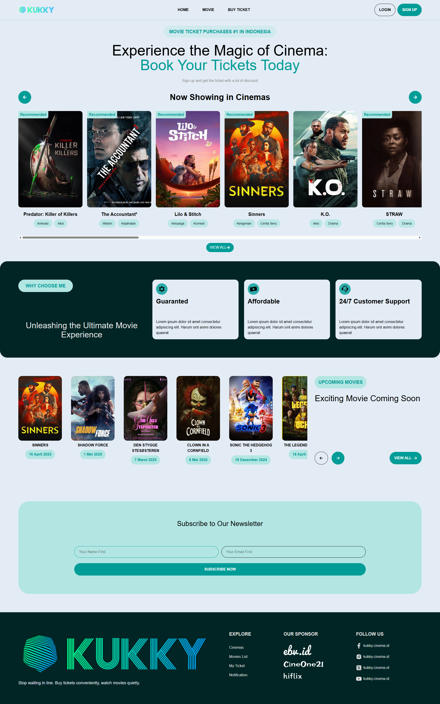

# React Example Project - Slicing Tickitz

This repository contains implementaion Slicing web app Tickitz with React.

## Preview




## How to Run

### Manual

1. Clone this project

```bash
git clone https://github.com/yusufbahtiarr/fgo24-tickitz.git
```

2. Enter the project directory

```bash
cd fgo24-tickitz
```

3. Install the Depedencies

```bash
npm install
```

4. Run the project

```bash
npm run dev
```

5. Project will running on http://localhost:8080

### With Docker

1. Clone this project

```bash
git clone https://github.com/yusufbahtiarr/fgo24-tickitz.git
```

2. Enter the project directory

```bash
cd fgo24-tickitz
```

3. Build image

```bash
docker build . -t tickitz:latest
```

4. Run image with docker

```bash
docker run -p 8080:80 -d tickitz:latest
```

5. Visit your app in http://localhost:8080

## Dependencies

To develop this app, we are using some dependencies:

- ReactJS
- TailwindCSS
- Redux Toolkit
- Redux Persist
- Axios
- React Icons
- React Hook Form
- React Toastify

And frontend tooling, the one and only:

- Vite

## Running the app locally

This project is built with Vite, which provides fast development with hot-reloading.

1. Access the app:

   - After starting the dev server, open:
     🔗 http://localhost:5173

2. Hot Reloading:
   - Any changes you make will automatically reflect in the browser.

## Contributing rules

- Create a Pull Request (PR) to the branch assigned to you (named after you).
- Follow these guidelines:
  - Semantic Commit Messages – Use clear, structured commit messages (e.g., feat: add user login, fix: resolve auth validation bug).
  - Semantic Branching (for local work) – Prefix your local branches with the commit type (e.g., feat/user-login, fix/auth-validation).

## Copyright

&copy; 2025 Kodacademy
